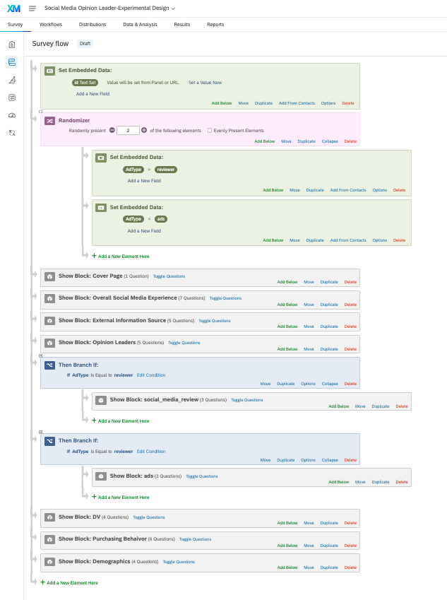
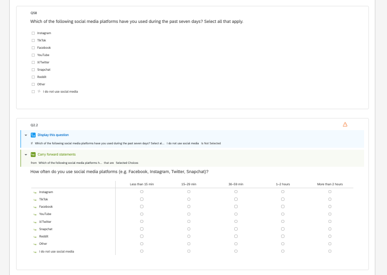
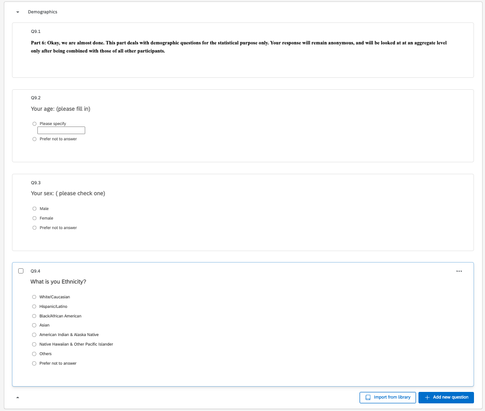
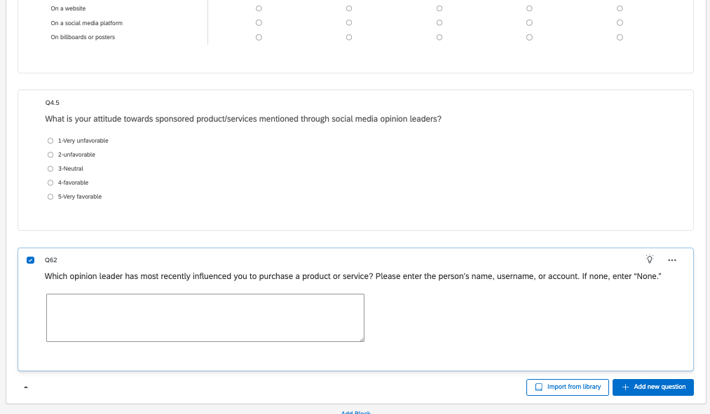
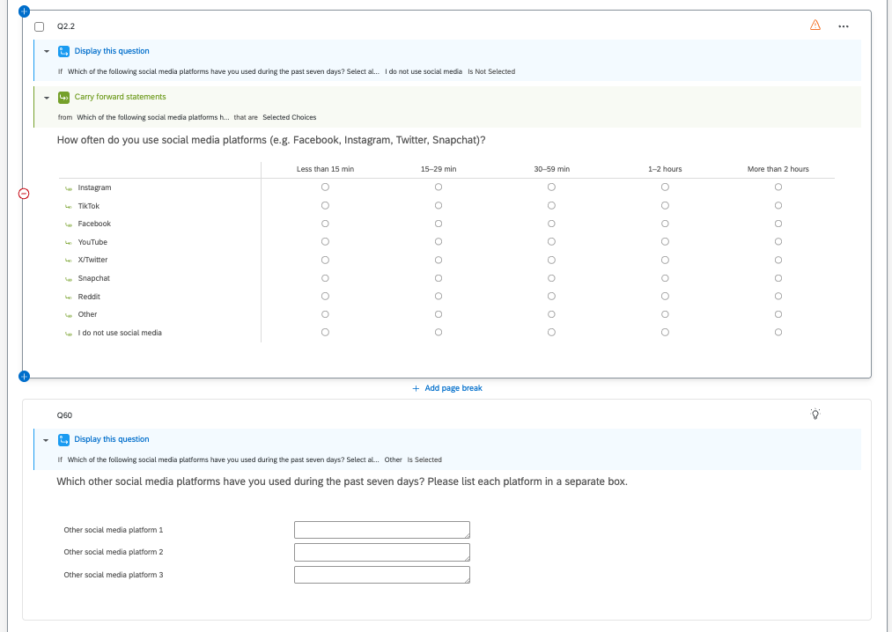

# Random assignment

> Random assignment using Randomizer and Branch functions in a Survey flow. Show the whole survey flow. If necessary, take multiple screen shots to capture the whole survey flow.

# Improvement of Q2.2

> Improvement of Q2.2 that allows you to capture the whole usage rate for all the social media separately, not as a whole. There are at least three ways that I know of. One method is to use a series of combinations of Piped Text function and Display Logic. Secondly, you may use Carry forward function. Regardless of which one you use, the first step will be to ask them to ask to tell you usage rate for each of the social media platform. My preference is carry forward method since it is more elegant and simple. You are required to achieve the goal with only one of the two methods to get full credit.

# Additional improvements

> Show additional three improvements you made in the questionnaire as part of Task 5 of Step 5, and explain why your approaches are better.

The following three improvements preserve the wording of the existing survey questions.

## Add “Prefer not to answer” to sensitive demographic questions

I added a `Prefer not to answer` response option to sensitive demographic questions, such as questions about gender, income, or other personal characteristics. This gives participants more control over their personal information and reduces the likelihood that they will abandon the survey.

This improvement changes only the response options and does not change the wording of the existing questions.

## Recent Purchase Influence

The original Opinion Leaders section does not directly measure whether a specific opinion leader recently influenced a participant’s purchase. I added an open-ended question asking participants to identify that opinion leader. This provides more specific information about the relationship between opinion-leader influence and actual consumer behavior.

## Identifying Other Social Media Platforms

Q2.2 only lists selected social media platforms and does not identify platforms categorized as “Other.” I added a follow-up question asking participants to list any other platforms they use, providing more complete information about their social-media usage.

# Appendix
Github Repo: <>  
Github Pages: <>